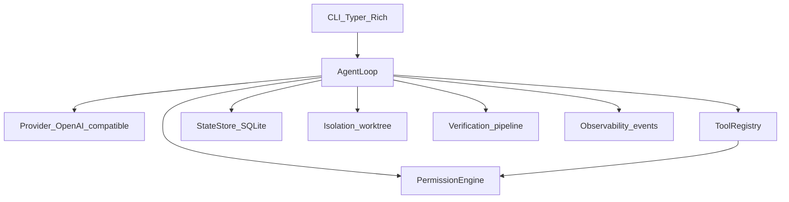

# CodeAgent

[](https://github.com/smadduri9/codeagent/actions/workflows/ci.yml)
[](LICENSE)

[](https://smadduri9.github.io/codeagent/)

A local, CLI-based autonomous coding agent. The model reasons; deterministic software searches, executes, constrains, verifies, persists, and observes.

Built in Python 3.12 with an OpenAI-compatible provider (Groq by default). See [DESIGN.md](DESIGN.md) for the full specification and [docs/OPERATOR.md](docs/OPERATOR.md) for day-to-day usage.

## What it does

- Runs an iterative **native tool-calling loop** with iteration, repeat, and budget guards.
- Applies a **deterministic permission engine** before every tool call; destructive actions require **single-use** human approval.
- Edits in an isolated **git worktree** (or branch fallback) with **checkpoints**, rollback, and a final diff.
- Runs a **verification pipeline** and **completion gate** so a run cannot finish as fully verified without recorded check evidence.
- Persists run state in **SQLite** for resume after interrupt, crash, or daily quota exhaustion (`WAITING_QUOTA`).
- Records **events** for reconstruction via `codeagent trace`.

## Demo


[Full recording (MP4)](docs/demo/terminal.mp4)

## Architecture



Dependencies point downward: the loop orchestrates; tools and permissions do not call back into the loop. Details in [DESIGN.md](DESIGN.md) section 4.

## Quickstart

Requirements: Python 3.12+, Git, ripgrep (`rg`). macOS arm64 and Linux are supported in CI.

```bash
git clone https://github.com/smadduri9/codeagent.git
cd codeagent
python3.12 -m venv .venv
source .venv/bin/activate
python -m pip install -e '.[dev]'
codeagent --help
scripts/check.sh
```

Configure a model id and API key before live runs (never commit keys). Example in [docs/OPERATOR.md](docs/OPERATOR.md):

```toml
# .codeagent/config.toml in your target repository
[model]
cheap = "openai/gpt-oss-20b"
main = "openai/gpt-oss-120b"
```

Set `GROQ_API_KEY` in the environment or in a gitignored `.env` at the repository root.

**Payment service demo** ([examples/payment_service/README.md](examples/payment_service/README.md)):

```bash
cd examples/payment_service
codeagent run "Expired cards return HTTP 500 during checkout. Find the cause and fix it. Do not change unrelated behavior."
codeagent trace
```

## CLI

| Command | Purpose |
|---------|---------|
| `codeagent` / `chat` | Interactive chat REPL (default when no subcommand) |
| `run` | Start a goal-directed run with streaming output |
| `resume` | Continue a saved run (including after quota wait) |
| `status` | Show run phase and budgets |
| `rollback` | Restore from a checkpoint |
| `init` | Scaffold local agent config in a repo |
| `trace` | Reconstruct events for a run |
| `eval` | Run the evaluation harness (replay or live slices) |
| `runs` | List and inspect stored runs |

## Engineering highlights

- **Safety is not promptable.** Allow, ask, and deny come from table-driven rules ([`permissions/`](src/codeagent/permissions/)), not model judgment (DESIGN D4, section 8.5).
- **Tool output is untrusted.** File and command text cannot change permissions (section 8.5, `tests/security/`).
- **Stable prompt prefix** for the run: system prompt and tool definitions stay fixed; compaction appends history (DESIGN D9, section 8.6).
- **Main vs cheap model** routing for cost control on small internal calls (DESIGN D12).
- **Free-tier pacing:** client-side rate limits, quota headers, graceful stop and resume (DESIGN section 8.20).

Shell strings cannot be proven safe by parsing; `run_command` uses argument arrays, `bash` is classified with default-ask, and optional Docker sandboxing is available (see [docs/decisions/0009-docker-sandbox-approach.md](docs/decisions/0009-docker-sandbox-approach.md)).

## Testing and evaluation

- **442** pytest cases in the default check script (live tests excluded); **7** security test modules under `tests/security/`.
- CI on **Ubuntu** and **macOS**: Ruff, strict mypy, pytest (live tests excluded), and `scripts/scan_secrets.sh`.

Evaluation ([DESIGN.md](DESIGN.md) section 11):

| Mode | Result | Notes |
|------|--------|--------|
| Scripted replay (40 tasks + harness smoke) | **42/42** pass | Drives `FakeProvider` through the real loop; see [evals/baselines/replay-40/](evals/baselines/replay-40/) |
| Live `core12` slice | **Partial** (2 tasks completed, 2 passed; 2 of 12 in slice) | Quota-aware; see [evals/baselines/live-core12-partial.md](evals/baselines/live-core12-partial.md) |

Replay proves harness and mechanics; live slices measure model quality under free-tier limits. Do not treat a partial live baseline as a full 40-task score.

## Design decisions and scope

- Full design: [DESIGN.md](DESIGN.md). Build history: [docs/PROGRESS.md](docs/PROGRESS.md). Decision records: [docs/decisions/](docs/decisions/).
- **Repository indexing (phase 9) was not built.** The baseline did not meet the gate in DESIGN section 9.1 ([docs/decisions/0008-phase-9-gate-not-met.md](docs/decisions/0008-phase-9-gate-not-met.md)). Search stays in the loop with `grep`, `glob`, and `read_file` until data says otherwise.
- **Scope:** tuned for small repositories and focused tasks under Groq free-tier context and quota limits (DESIGN section 8.20). Not aimed at large monorepos or Windows.

## Repository map

```
src/codeagent/
  cli*.py              Typer entrypoints and streaming UI
  loop/                Agent loop, guards, completion gate, policy hook
  providers/           OpenAI-compatible provider, fake, rate limits, quota
  tools/               Files, search, commands, git, plan, verify
  permissions/         Rules engine, shell classify, approvals, untrusted wrap
  context/             Context assembly, compaction, instructions
  state/               SQLite store, resume, history
  isolation/           Worktree, checkpoints, optional Docker sandbox
  verification/        Detect checks, pipeline, flaky handling
  observability/       Events, sinks, trace reconstruction
  config.py            Layered TOML settings
```

## Documentation

| Document | Audience |
|----------|----------|
| [docs/README.md](docs/README.md) | Index of project docs |
| [docs/OPERATOR.md](docs/OPERATOR.md) | Running the agent on your repos |
| [DESIGN.md](DESIGN.md) | Architecture and invariants |
| [BUILD_PLAN.md](BUILD_PLAN.md) | Feature plan and phases |
| [AGENTS.md](AGENTS.md) | Rules for contributors and build agents |

## Development

Contributors and automated builds follow [AGENTS.md](AGENTS.md): one feature per branch, `scripts/check.sh` before every commit. Tests marked `@pytest.mark.live` are optional and excluded from the default check script.

## License

MIT. See [LICENSE](LICENSE).
